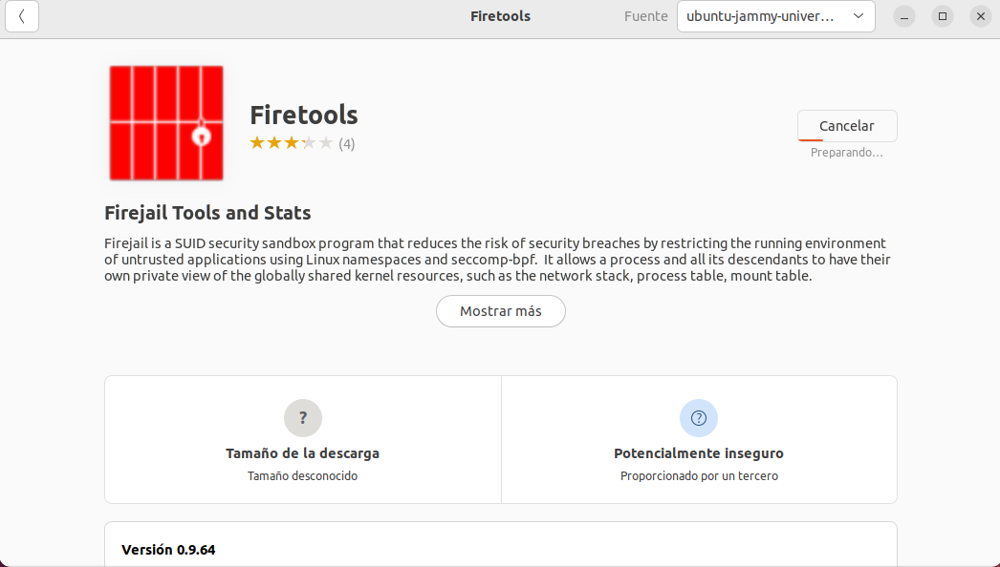
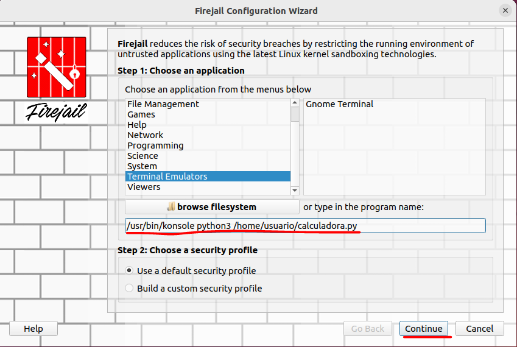
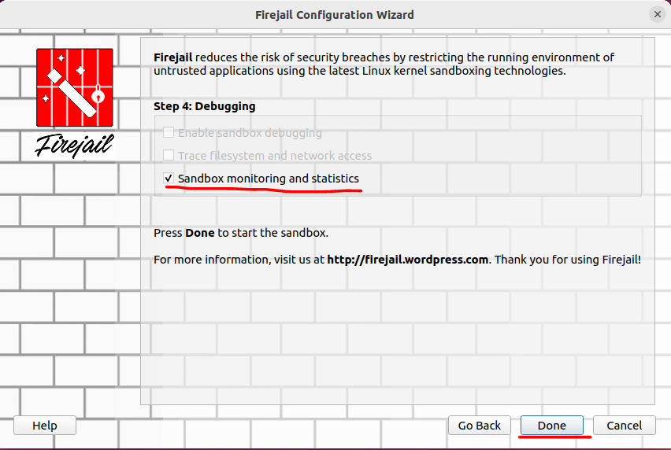
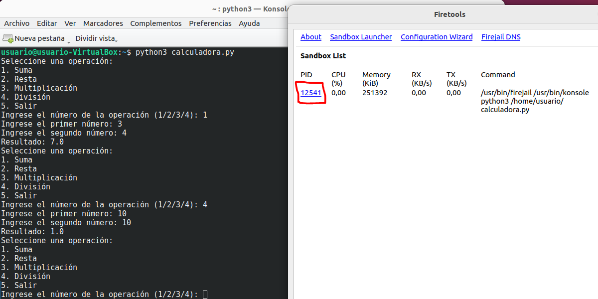
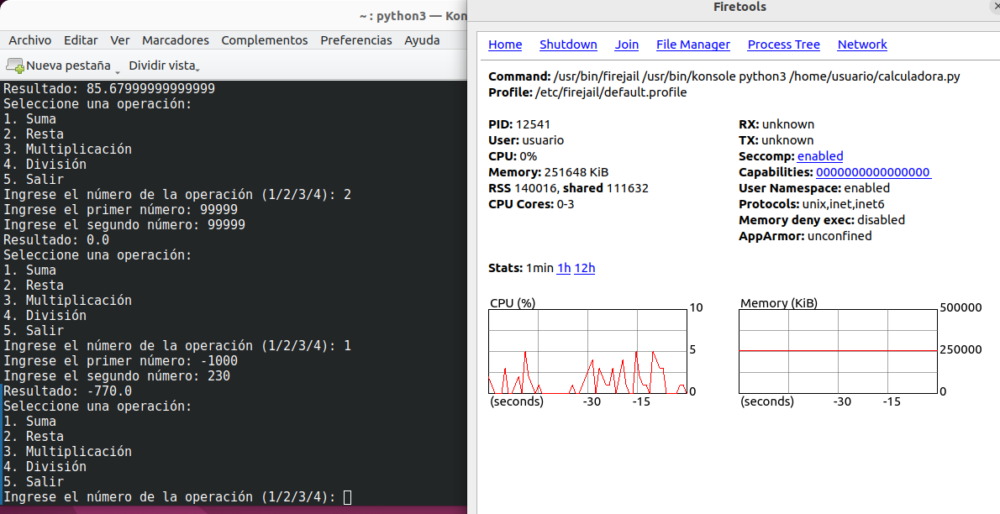
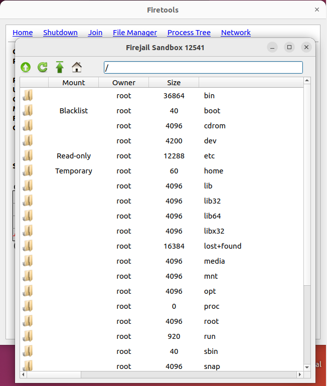
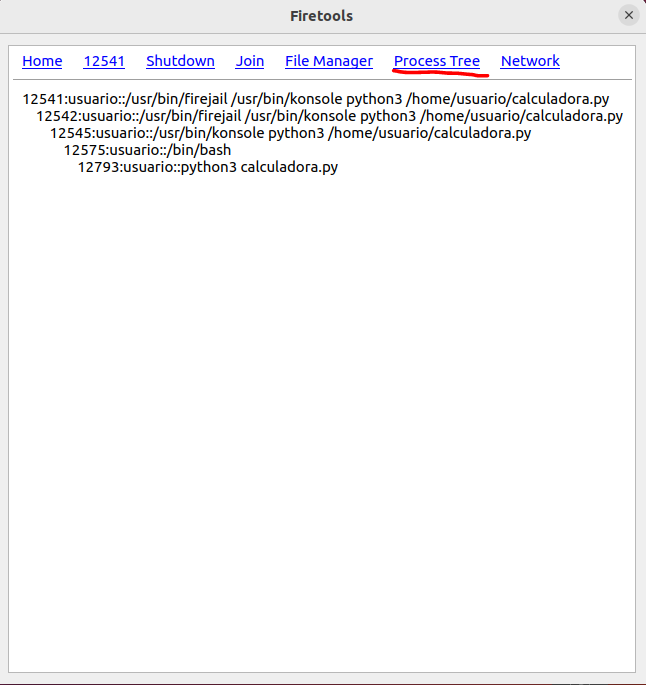

# Actividad 4: Prueba de aplicaciones en entorno controlado: Sandbox

## Indice:

#### [1. Alternativas de Sandboxes](#alternativas-de-sandboxes)  
#### [2. Creando entorno controlado y probando la calculadora](#creando-entorno-controlado-y-probando-la-calculadora)

## Alternativas de Sandboxes

Algunas de las opciones mas comunes que nos permiten crear sandboxes son:

> -**Máquinas virtuales** --> Ejecutan un sistema operativo completo dentro de otro, permitiendo pruebas aisladas.  

> -**Contenedores** --> Crean entornos de ejecución ligeros y sin necesidad de un sistema operativo completo, aunque no proporciona un aislamiento total como una VM (dependen del kernel del anfitrión).  

> -**chroot (linux)**  --> Crea un entorno aislado con su propio sistema de archivos en el mismo sistema operativo, aunque también puede interactuar con el kernel.  

> -**Firejail** --> Herramienta de sandboxing que aísla procesos y aplicaciones en entornos restringidos, además es fácil de usar.  

> -**Windows Sandbox** --> Funcionalidad en Windows 10/11 Pro y Enterprise que permite ejecutar aplicaciones en un entorno completamente aislado.  

## Creando entorno controlado y probando la calculadora

Para esta prueba vamos a utilizar `Firejail` con entorno gráfico que es una herramienta de sandboxing fácil de usar, y vamos a probar nuestra calculadora creada en ejercicios anteriores, todo ello en Ubuntu:

1. Lo primero es descargarnos `Firetools` que es el paquete de herramientas de Firejail, lo descargamos desde la tienda oficial de Ubuntu :

2. Una vez descargado, ya podemos abrirlo e indicarlo que nos abra una sandbox sobre el emulador de terminal de Konsole y, a continuación, le indicamos que vamos a ejecutar en konsole el fichero calculadora.py:

3. En el siguiente apartado activamos la opción de *'sandbox monitoring and statistics'* para que cuando estemos ejecutando el sandbox nos ofrezca herramientas de monintorización y la damos a Done:

4. Una vez echo esto ya se nos ejecuta 'Konsole' y podemos probar la calculadora, al lado derecho nos aparece un cuadro indicando el proceso de la ejecución, la memoria, el porcentaje de cpu consumida, etc:

5. Si hacemos click en el número del proceso se nos desplega otro menu con estadísticas mas visuales, como la cpu y la memoria que consume en un gráfico ademas de otros datos, para ir consultando mientras realizamos pruebas en nuestro programa:

6. Las estadísticas y datos que nos ofrece Firetools respecto al programa que estamos ejecutando son muchas por ejemplo, en el apartado de "File Manager" podemos ver todos los archivos que se han creado para la ejecución, algunos de ellos temporales:

7. También podemos consultar el arbol de procesos que se han ido ejecutando pulsando en el apartado de "Process Tree":

